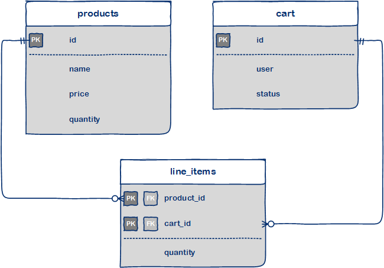

# Database Modelling

This exercise is an introduction to modelling in MongoDB. The main goal is to see that a Mongo database doesn't require join tables for many-to-many relations and to make a decision between embedding a document or storing a reference.

Introduce the case and let student come up with a document model and discuss the results classically.

> **Note:** not all students might have any experience with database modelling (especially minor students).

## Casus - Online store

We have a very simple relational data model for an online store (see diagram).

_Figure 1. Relational data model_

The model consists of the following concepts:

- **products** – The products sold by the online store. Nothing fancy, just a `name`, a `price` and a `quantity` representing the number of items in stock.
- **cart** – A shopping cart belonging to a `user` (to keep it simple: just a string for now). A shopping cart also has a `status` that contains either 'active' or 'complete' (ready for payment).

To link the two concepts together, in relational models, a many-to-many table is added to keep track of the mapping between `cart`‘s and `product`‘s. In this case it is modelled as `line_items` and also contains the `quantity` of a product in the cart (this is a different `quantity` than the one found in product).

## Question

**What would a suitable data model be in MongoDB?**

Specify the collections, documents, embedded documents and links (if any). Also keep in mind the possible acces patterns an application will use.

## Solution

For a (possible) solution see [answer.md](answer.md).
