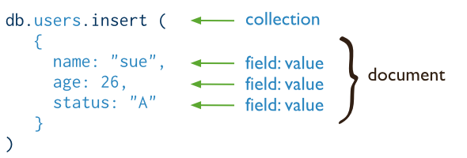

# Terminology

Show the diagrams from [MongoDB CRUD Operations](https://www.mongodb.com/docs/manual/crud/). A lot of examples comparing MongoDB and SQL can be found at [SQL to MongoDB Mapping Chart](https://www.mongodb.com/docs/manual/reference/sql-comparison/).

## CRUD Operations - MongoDB vs SQL

|        | MongoDb                                              | SQL                                          |
| ------ | ---------------------------------------------------- | -------------------------------------------- |
| create |  |  |
| read   |      |    |
| update |  |  |
| delete |  |  |
